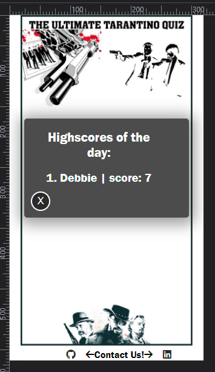
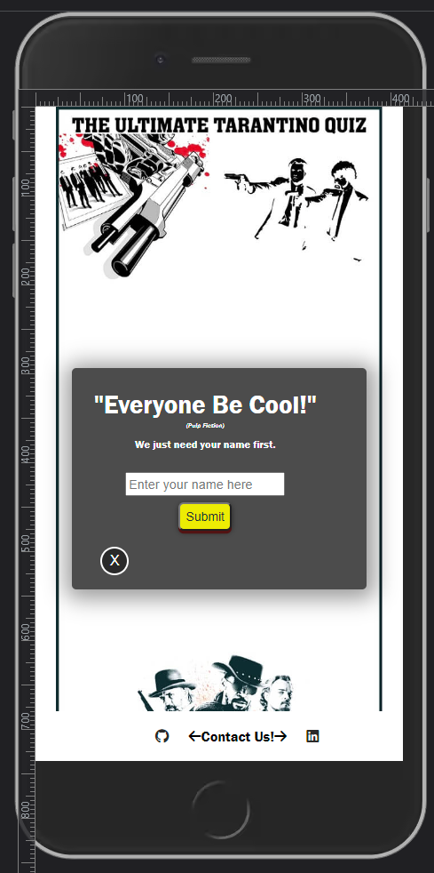
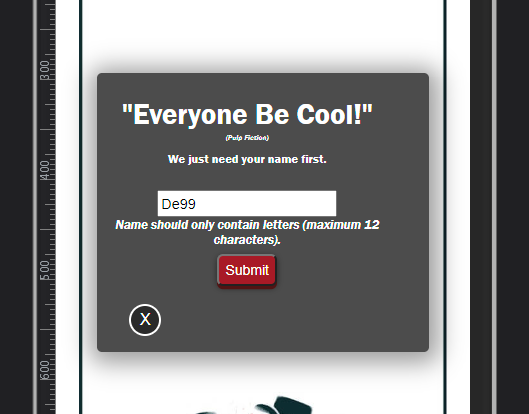
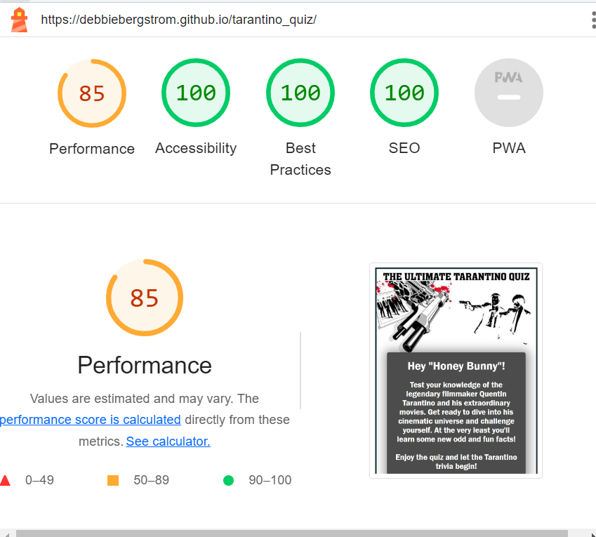

# **The Ultimate Tarantino Quiz**

Welcome to the Quentin Tarantino Movie Quiz, a trivia experience crafted for movie fans. This quiz is a celebration of the iconic films directed by Quentin Tarantino, known for his unique storytelling style and unforgettable characters. With a passion for Tarantino's movies at its core, this quiz aims to test your knowledge and immerse you in the thrilling world of his cinematic masterpieces.

<b>Visit the deployed site:</b> [the Ultimate Tarantino Quiz](https://debbiebergstrom.github.io/tarantino_quiz/)

&nbsp;

## **CONTENT**

## Table of Content

1. [Project Goals](#project-goals)
    1. [User Goals](#user-goals)
    2. [Returning Visitor Goals](#returning-visitor-goals)
    3. [Site Owner Goals](#site-owner-goals)
    4. [Developer Goals](#developer-goals)
2. [User Experience](#user-experience)
    1. [User Stories](#user-stories)
3. [Design](#design)
    1. [Colour](#colours)
    2. [Fonts](#fonts)
    3. [Structure](#structure)
    4. [Wireframes](#wireframes)
4.  [Features](#features)
5. [Technologies Used](#technologies-used)
    1. [Languages](#languages)
    2. [Frameworks & Tools](#frameworks-&-tools)
6. [Testing](#validation)
    1. [HTML Validation](#HTML-validation)
    2. [CSS Validation](#CSS-validation)
    3. [Accessibility](#accessibility)
    4. [Performance](#performance)
    5. [Device testing](#performing-tests-on-various-devices)
    6. [Browser compatibility](#browser-compatability)
    7. [Testing user stories](#testing-user-stories)
8. [Bugs](#Bugs)
9. [Deployment](#deployment)
10. [Credits](#credits)
11. [Acknowledgements](#acknowledgements)

&nbsp;

## **GOALS**
### **Project Goals**
The goal of this project is to create an engaging and entertaining quiz experience centered around Quentin Tarantino's movies. The quiz aims to captivate users, test their knowledge, and provide interesting insights about Tarantino's films. The website's design will reflect the vibrant and dynamic nature of his movies, while the user interface will be intuitive and user-friendly. Overall, the Tarantino Movie Quiz strives to provide a fun and immersive experience for movie enthusiasts to celebrate the work of this renowned director.

### **User Goals**

- An engaging and visually appealing quiz app that captures the essence of Tarantino's movies.
- Clear and concise rules and instructions on how to play the quiz.
- Easy navigation between the home page, rules page, highscores page, and quiz page.
- A fun and interactive quiz experience with 10 challenging questions about Tarantino's films.
- Well-placed Tarantino quotes throughout the app to enhance the overall experience.
- Clear display of the user's score at the end of the quiz to celebrate their achievement.
- Responsive design that ensures the app works on all devices.
- Easy access to social media links in the footer for further engagement and interaction.
- A visually appealing and immersive environment that reflects the style and atmosphere of Tarantino's movies.
- A memorable and enjoyable experience that leaves users entertained and motivated to share their scores and invite others to take the quiz.

### **Returning Visitor Goals**

- Easily access the quiz and start playing without any hassle.
- Review the quiz rules or instructions for a quick refresher.
- Check the updated highscores list to see if their previous score is still among the top.
- Challenge themselves to improve their previous score and beat their own record.

### **Site Owner Goals**

- Promote the quiz app as a fun and engaging activity related to Quentin Tarantino and his movies.
- Increase user engagement and time spent on the website by offering an entertaining quiz experience with more future features.
- Provide clear visibility in the footer with links to the owner's GitHub and LinkedIn pages, allowing users to easily contact and provide feedback.

### **Developer Goals**

- Develop an engaging and interactive quiz app that captures the essence of Quentin Tarantino's movies.
- Implement a responsive and user-friendly design that ensures a seamless experience across all devices.
- Create a well-structured and organized codebase to facilitate easy maintenance and future updates.
- Implement efficient functions for scoring and displaying quiz results accurately and dynamically.

&nbsp;

## **USER EXPERIENCE**

&nbsp;
### **USER STORIES**
#### **First time users**
1. _As a first-time user, I want to easily understand the instructions and rules of the quiz._
2. _As a first-time user, I want to navigate through the quiz questions effortlessly._
3. _As a first-time user, I want to see my score and know how well I performed in the quiz._
4. _As a first-time user, I want to have an enjoyable and engaging experience while answering the quiz questions. -
5. _As a first-time user, I want to easily access the highscores list to see how my score compares to others._

#### **Returning users**
8. _As a returning user, I want to challenge myself with new quiz questions and test my knowledge again._
9. _As a returning user, I want to easily navigate back to the highscores list to see if my previous score has improved._

#### **Site owner**
10. _As the site owner, I want users to have an enjoyable experience while playing the quiz._
11. _As the site owner, I want users to share their quiz results with friends, helping to increase the visibility and reach of the quiz and attract more users to play._

&nbsp;

## **FEATURES**
&nbsp;
### **PAGES: HOME, RULES, SCORE LIST, NAME FIRST, QUIZ, DISPLAYED SCORE**

The website has 15 responsive pages, counting the Home page, the Rules page, the Highscore page, the Enter name first page, the quiz and finally a page that dispays the users score after the game. The Quiz contains 10 pages with randomly selected different questions/ answers and a unique images displayed for each one. 
By using correct HTML markup and labels it is ensured screen readers can accurately interpret the pages.
The website is composed of the following pages:

- **Home Page:** The home page serves as the entry point to the quiz app. It welcomes users with the *"Hey Honey Bunny"* message inspired by a famous line from the movie *Pulp Fiction*, adding a touch of fun and engagement to the experience.and provides a brief introduction to the quiz. Users can easily navigate to other pages from the home page.

Home Page

- **Rules Page:** The rules page provides users with a clear understanding of the quiz rules and instructions.

Rules Page

- **Highscores Page:** The highscores page displays a list of top scorers in the quiz. Users can see their own score and compare it with others.

Highscores Page

- **Name first Page:** The name page is the initial page where the user is prompted to enter their name. It is designed to collect the user's name and store it to later pair it with their quiz score.
Features of the Name Page:

    - An input field with a placeholder text saying "Enter name here." The input field has an HTML label that is visibly hidden but still accessible to screen readers.
    - The input field has certain requirements: it allows only letters, has a maximum character limit of 12, and displays an error message if the entered name is not valid.
    - If the user enters an invalid name, an error message is shown, specifying the required format for a valid name.
    - Once the user enters a valid name and submits it, a previously hidden button is displayed, saying "Let the quiz begin!" This button serves as the trigger to start the quiz.

The Name Page ensures that the user provides a valid name and allows them to proceed to the quiz only when the name input meets the specified requirements.

First Name Page

Validation that name input is not correct

Validation for user after correct name input

&nbsp;

- **Quiz Page:** The quiz page is where the actual quiz takes place. Eanh time a user plays the questions are randomly selected. It presents users with a series of 10 questions related to Tarantino's movies. Each question is accompanied by multiple-choice options, allowing users to select their answers. Upon completing the quiz, users receive an immediate score display. 
    - The next-button doesn't get displayed until the user chooses an option.
    - If they are correct, the field turns green, otherwise the incorrect choice turns red and the correct answer shows with green. 
    - A question counter is added to the bottom left for the user to know how many questions they've answered and how many there's left.
    - A timer function is placed at the bottom left, counting down from 15 seconds. The numbers are green until it reaches 5 seconds left, then it turns red. This makes the user hurry up to not loose a point. When an answer has been selected, the timer stops and the user can't change the option, only press the now displayed Next-button.
    - If timer reaches 0, the user can no longer choose option, and has to press the Next button to move forward. No score received. 

Quiz showing new question

Quiz showing timer, and the Next button

&nbsp;

- **Displayed Score Page:** After completing the quiz, users are shown a concise score page displaying their results. They are then redirected to the highscore list, where they can view their score and compare it with other participants by clicking the "Show me Highscore list" button.

### **FOOTER**

- The footer is fixed on every page and contains the media links to owners LinkedIn page and GitHub page, so that anyone who plays the quiz can easily can get in contact withe owner for feedback.

&nbsp;
### **FUTURE FEATURES**

&nbsp;
In the future, there will be exciting plans to enhance this movie quiz project. The focus will be on improving various aspects to make the quiz more engaging and enjoyable for users.

- Expanded Question Library: One of the key future enhancements is to create a much larger library of questions. This will ensure that each time a user plays the quiz, they will be presented with a different set of questions. Having a diverse and extensive question pool will add variety and prevent users from memorizing the answers, making the quiz more challenging and fun.

- Enhanced Scoreboard: The scoreboard will undergo significant improvements to make it visually appealing and provide a clearer representation of users' scores. The goal is to incorporate funny images and text based on how well users scored, adding a touch of humor and entertainment to the experience.

- Time-Based Scoring: The scoring system will be updated to take into account the speed at which users answer questions. The final score will be determined not only by the number of correct answers but also by how quickly users respond. This time-based scoring mechanism will add an element of urgency and encourage users to think fast and act swiftly.

- Keyboard Navigation: To enhance accessibility and user convenience, keyboard navigation will be implemented. This feature will allow users to navigate and interact with the quiz using keyboard shortcuts, providing an alternative input method for those who prefer or require it.

These future implementations will significantly elevate the movie quiz experience, offering a larger question pool, improved scoring, entertaining visuals, and enhanced accessibility. These enhancements aim to make the quiz more engaging, challenging, and enjoyable for all users.

&nbsp;

## **DESIGN**

### **Colors**
- Color scheme inspiration was taken from the movies themselves, with a lot of sharp contrast with black, white, blood red and fiery yellow. 
- These design choices was thought to help create a visually appealing and cohesive website that will leave a positive impression on our visitors.

 
The colour palette was created using the [Coolors website](https://coolors.co/521313-2a2a2a-ffffff-ecec03-c59849).

### **Fonts**

- Logo which is sesigned into the background image was made with the fontstyle Aachen Bold, which is used in the famous Tarantino movie “Pulp Fiction”. 
- Througout the rest of the site font 'Franklin Gothic Medium''(Arial Narrow', Arial, sans-serif as backups) is used as a fitting simple font that goes well with the logo font.

### **Structure**

The site has been designed with a user-friendly and intuitive structure. 

The site's structure aims to guide users seamlessly through these pages, providing an enjoyable and interactive experience while exploring the quiz and testing their knowledge of Tarantino's movies.

### **Wireframes**

HOME

RULES

SUBMIT NAME

HIGHSCORE LIST

QUIZ

DISPLAYED SCORE

&nbsp;

## **Technologies Used**

### **Languages**
- HTML
- CSS
- JavaScript

### **Frameworks & Tools**
- Git
- GitHub
- Gitpod
- Tinypng
- Paint (for Windows)
- Balsamiq
- Google Fonts
- Adobe Photo Shop
- Adobe Express
- Snapseed
- Font Awsome
- Favicon.io 
- W3C validator
- Jigsaw CSS validator
- JSHint JavaScript validator
- WAVE Web Accessibility Evaluation Tool

&nbsp;

## **Testing**

### **HTML Validation**

The W3C Markup Validation Service was used to validate the HTML of the website. It passes except for one error:
 
Empty heading.
From line 90, column 25; to line 90, column 44

          <h4 id="name-error"></h4>↩

It concerns a hidden error-message that occurs if the user doesn't type their name correctly in the input field. Also mentioned in the below Accessibility section.

index.html, link to [results](https://validator.w3.org/nu/?doc=https%3A%2F%2Fdebbiebergstrom.github.io%2Ftarantino_quiz%2F)

&nbsp;

### **CSS Validation**

The W3C Jigsaw CSS Validation Service was used to validate the CSS of the website.
&nbsp;

style.css, link to [results](https://jigsaw.w3.org/css-validator/validator?uri=https%3A%2F%2Fdebbiebergstrom.github.io%2Ftarantino_quiz%2F&profile=css3svg&usermedium=all&warning=1&vextwarning=&lang=sv)

&nbsp;

### **Accessibility**

I have coded to ensure that the website is as accessible friendly as possible. This was done by:

* Using semantic HTML elements.
* Declare the Language in the beginning the html page.
* Using descriptive alt-attributes on images and links on the site.
* Using a hover funtion on all buttons so it's clear for the user if they are hovering over a button.
* Providing information for screen readers where there are icons used and no text.
* Ensuring that there is a sufficient colour contrast throughout the site.
* Ensuring menus are accessible by marking the current page as current for screen readers.

The WAVE WebAIM web accessibility evaluation tool was used to ensure the website met high accessibility standards. The application pass except for one error, see provided image below. It concerns a hidden error-message that occurs if the user doesn't type their name correctly in the input field. 

See link to [results](https://wave.webaim.org/report#/https://debbiebergstrom.github.io/tarantino_quiz/)

See image of listed error

&nbsp;

### **Performance**
Google Lighthouse in Google Chrome Developer Tools was used to test the performance of the website. Due to experiencing trouble getting Lighthouse to work, a tutor att Code Institute had to run the test and send me a screenshot of the result. The result couldn't be perfected because the specifications on the result wasn't able to get. Therefore, when submitting this project, potential issues couldn't be resolved. 

LightHouse Testing

### **Performing tests on various devices**
The website was tested on the following devices:
- Desktop screen 4k
- Samsung s22 Ultra
- iPhone XR
- Samsung 360 Laptop

Tested for responsivness through Google Chrome Dev Tools different preset devices. 

See image for list of devices 

### **Browser compatability**
The website was tested on the following browsers:
- Google Chrome
- Mozilla Firefox
- Microsoft Egde

&nbsp;

### **Testing User Stories**

The user stories and features were thoroughly tested to ensure interactivity, feedback, notification, responsiveness, accessibility, and validation. Both manual and automated testing techniques were employed to cover various scenarios and edge cases.

By evaluating each user story against its corresponding feature, we ensured that the intended goals were met and a satisfactory user experience was provided.

Testing the individual features focused on input validation, proper display of information, accurate calculations, user interactions, and responsiveness across different devices.

Any bugs or issues encountered that did not meet the desired outcome were documented and listed under the Bugs section. These will be addressed in future iterations to enhance the user experience.

Screenshots were taken to showcase the features in action, illustrating their expected behavior and visual presentation.

In conclusion, the testing process confirmed the successful implementation of user stories and the functional behavior of features, ensuring interactivity, feedback, notification, responsiveness, accessibility, and validation were effectively incorporated into the project.

&nbsp;

## **Bugs**

| **Bug** | **Fix** |
| ----------- | ----------- |
| 1. When reloading page, both Home Page and Quiz is visible, but quiz should be hidden | Added !important to the hidden class with display:none|
| 2. Couldn't get the quearySelector to get elements by ID| I changed to getElementsById |
| 3. Can't get the images to size properly in the game-box contaner| Changed image sizes and width to 100%, height auto.|
| 4. Couldn't get the next button in the quiz to move to next question| I found the mixup between variables allQuestions and quizQuestions and corrected it.|
| 5. When the quiz restarts, the images doesn't get displayed | Added location.reload(); to the btnExitToHome3 which user clicks at end of quiz|
| 6. Couldn't get the exit-buttons to work except for one place| Had to make several exit-buttons with different IDs|
| 7. Couldn't get the btn-to-name-first to work except for one place| Had to make another button with different ID|
| 8. The timer kept counting down below 0 and showed negative numbers| Changed the code to (currentTime <= 0) instead of (currentTime === 0) |
| 9. The timer numbers became jumpy when counting down| Went through the code and saw that the function startTimer was called on to many times, removed unneccessary ones |
| 10. Couldn't get the scoreList array to collect userScore and display them in highscore-box| Made a variable of name and score and pushed it to the array using "highscores.push(userScore);|
| 11. The submit-button doesn't work on mobile diveces, making it impossible to play the quiz| Making several changes in the initialize-function it became accessible in mobile. |
| 12. Timer stops at zero, but user can still choose an answer | Added function to disable question answers when timer is at 0 and to display Next-button |

&nbsp;

| **Known Bugs to be resolved** | **Comments** |
| ------------- | ------------ |
| 1. The score list doesn't display an ordered list with numbers as desired | This bug was present earlier in the project, but an undetected issue caused it to disappear. Due to time constraints, it couldn't be fixed before the project submission deadline. It will be resolved in future updates. 

See image: Score List

 |
| 2. Unable to collect user scores and display them in the highscore box | This bug was previously fixed in line 10 as mentioned in the "Fixed Bugs" section. Unfortunately, an undetected bug caused its functionality to break again. Due to time constraints, it couldn't be fixed before the project submission deadline. It will be rectified in future updates. 

See image: Score List

 |

&nbsp;

## **Deployment**

**To deploy the website, the following steps were taken using GitHub Pages:**

1. Navigate to the Settings tab in the GitHub repository.
2. Select Pages from the left-hand menu.
3. Choose the branch Main as the source.
After the webpage refreshes, a ribbon will appear at the top saying that "Your site is published at https://debbiebergstrom.github.io/tarantino_quiz/".

**To fork the repository, follow these steps:**

1. Go to the GitHub repository.
2. Click on the Fork button located in the upper right-hand corner.

**To clone the repository, follow these steps:**

1. Go to the GitHub repository.
2. Click on the Code button located above the list of files.
3. Select your preferred method of cloning using HTTPS, SSH, or Github CLI, and click the copy button to copy the URL to your clipboard.
4. Open Git Bash.
5. Change the current working directory to the one where you want the cloned directory to be.
6. Type "git clone" and paste the URL from the clipboard (e.g., "$ git clone https://github.com/DebbieBergstrom/tarantino_quiz").
7. Press Enter to create your local clone.

&nbsp;

## **Credits**

### Here's a collection of sites that were helpful in creating this website:
&nbsp;

To help me understand toggling between elements: [SoftAuthor](https://softauthor.com/javascript-toggle-class-element/)
 
To help me understand the use of quearyselectors: [W3cSchools](https://www.w3schools.com/jsref/met_document_queryselector.asp)
 
To help me understand arrays of different kinds: [MozillaDeveloper](https://developer.mozilla.org/en-US/docs/Web/JavaScript/Reference/Global_Objects/Array), 
 [JavaScriptInfo](https://javascript.info/array)
 
To help me understand local storage using JSON: [PlainEnglish](https://plainenglish.io/blog/how-to-store-json-data-in-local-storage-js-react-angular)
 
To help me understand making a highscorelist: [youTubeTutorial](https://www.youtube.com/watch?v=jfOv18lCMmw)
 
&nbsp;

Quiz tutorials:
 
[youTubeQuizTutorial1](https://www.youtube.com/watch?v=xZXW5SnCiWI&t=224s)
 
[youTubeQuizTutorial2](https://www.youtube.com/watch?v=PBcqGxrr9g8)

Create some of the text content:  Worked together with [ChatGPT](https://openai.com/)

&nbsp;

### **Media**
Free movie images taken from [Wallpaperflare](https://www.wallpaperflare.com/search?wallpaper=quentin+tarantino) and [Pixabay](https://www.pixabay.com)

Timer icon taken from: [FlatIcon](https://www.flaticon.com/free-icon/stopwatch_10028890?term=timer&page=1&position=19&origin=tag&related_id=10028890)

Facts to the movie questions were taken from the following sites: 
https://www.thefactsite.com/quentin-tarantino-facts/ 
https://videolibrarian.com/articles/lists/quentin-tarantino-10-facts-for-10-films/ 
https://screenrant.com/reservoir-dogs-movie-uncut-ear-slicing-scene-deleted/ 
https://www.kickassfacts.com/25-interesting-facts-about-django-unchained/ 
https://variety.com/2017/film/news/7-facts-about-reservoir-dogs-1202403659/ 
https://www.imdb.com/title/tt3460252/trivia/ 
https://screenrant.com/hateful-eight-quentin-tarantino-behind-the-scenes-facts-trivia/#there-was-a-scrapped-connection-to-django-unchained 
https://www.esquire.com/entertainment/a28527935/once-upon-a-time-in-hollywood-charles-manson-what-happened/

&nbsp;

## **Acknowledgements**

I would like to take the opportunity to thank:
- My mentors at Code Institute for his support, advice and for pushing me in the right way. 
- My family for being really supportive. Extra credits to two testers who have made significant contributions: [Kim B](https://github.com/KimBergstroem) and [Sandra B](https://github.com/SandraBergstrom). They have been instrumental in providing necessary feedback, identifying errors, and offering valuable tips.
- To the teachers at Code Institute and Slack for providing help and updates.
- My boss at my job who's been supportive and helpful with working scheduls.

